# Git Installation through [tools_installer](./tools_installer.bat)
- If you already have Git installed on your machine then it is optional to install new version.

1. For online installation script downloads **Git 2.47.1 64-bit version** from the internet.
2. For offline execution already available Git 2.47.1 64-bit version from '\Tools\' directory is used.

## Installation steps for script [tools_installer](./tools_installer.bat)
1. The script will call **Git (2.47.1) installer**
2. Click **Next** on license page
3. Select destination folder and then click **Next**
   
   If destination folder already exist, either select different setination folder or continue install in that folder anyways.

4. Select component to install and click **Next**. _(Mostly default selection is sufficient)_
5. On Select Start Menu Folder - 
   - To go with default folder click **Next**
   - To select different folder click on **Browse** and select start menu folder
   - Or select checkbox to not create Start Menu Folder
6. Choose the deafult editor used by **Git** and click **Next**
   
   There are many options to choose, select your preferred option from drop down.

7. Name of the initial branch in new repositories _(Branch name when new repository is created)_
   Choose `Let Git decide` and click **Next**

8. Adjust `PATH` environment variable _(Choose **Recommended** option)_ then click **Next**
9. Choose _bundled OpenSSH_ and click **Next**
10. Choose OpenSSL library as HTTPS transport backend and click **Next**
11. Select `Checkout Windows-style, commit Unix-style line endings` for line ending conversions and click **Next**.
12. Select `MinTTY` as terminal emulator for **Git Bash** and click **Next**
13. Choose `Fast-forward or merge` as default behaviour of `git pull` and click **Next**
14. Choose `Git Credential Manager` as creadential helper and click **Next**
15. `Enable file system caching` and click **Install**
16. Installation may take upto few minutes. Click **Finish** once done.

## Setup GitHub Desktop

### Git installtion

## What is git?
#it is a powerful tool for managing source code, allowing you to track changes made to files over time, revert to previous versions, and collaborate effectively with other developers on projects by enabling multiple people to work on the same code simultaneously and merge their changes together

## How to install ??
- 1) Click on link "https://github.com/git-for-windows/git/releases/download/v2.47.1.windows.1/Git-2.47.1-64-bit.exe"

Click on Next for defualt installtion ( 2 to )
- 2) Git setup window open.
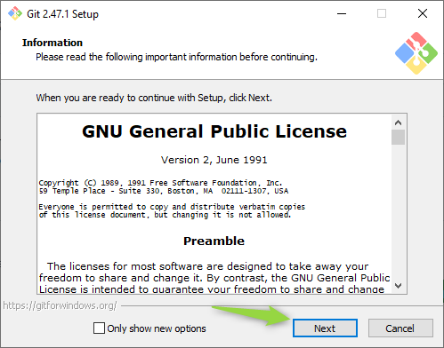

- 3) Select components
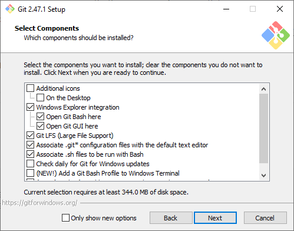

- 4) Choosing the defualt editor used by git
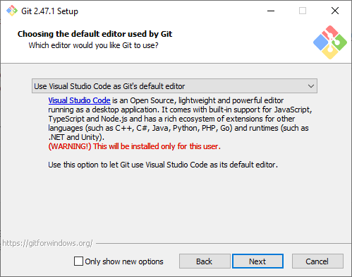

- 5) Initial branch in new repository
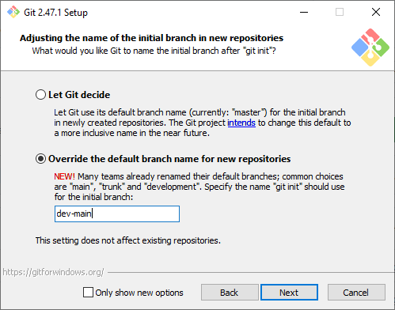

- 6) Git wrapper path for using git bash
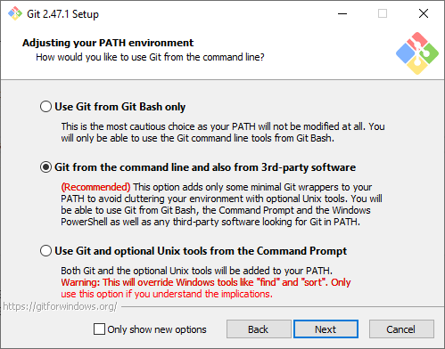

- 7) Secure shell for git
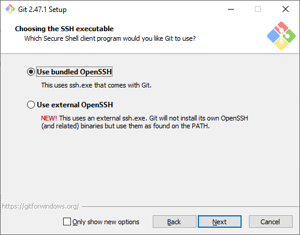

- 8) https transport backend
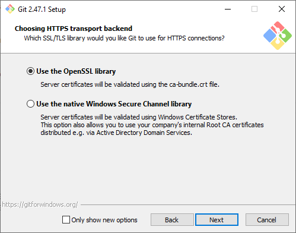

- 9) click on next
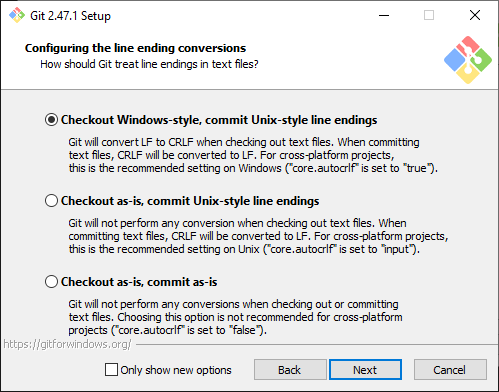

- 10) teminal emulator
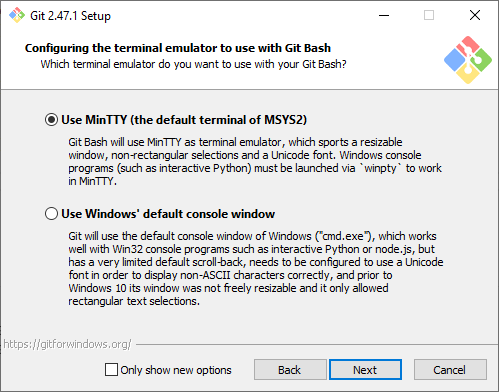

- 11) Git pull (Choose rebase)
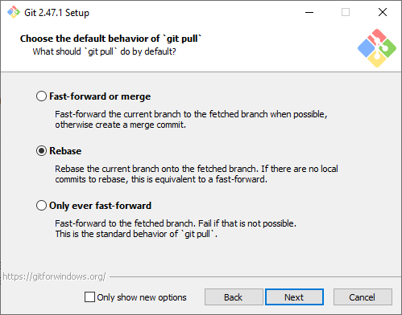

- 12) credential helper(None)
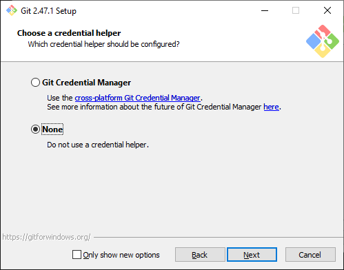

- 13) Choose install option
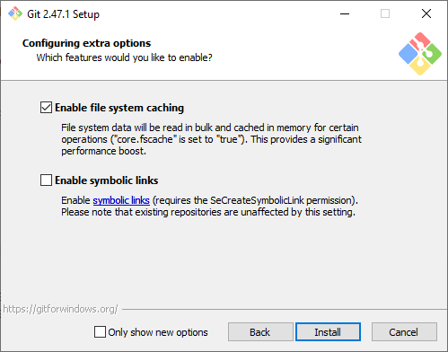

Wait for sometime to install Git on windows system 

- 14) click on "Finish"
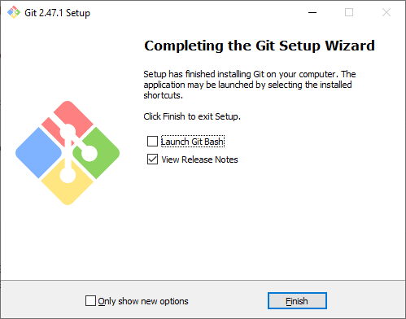