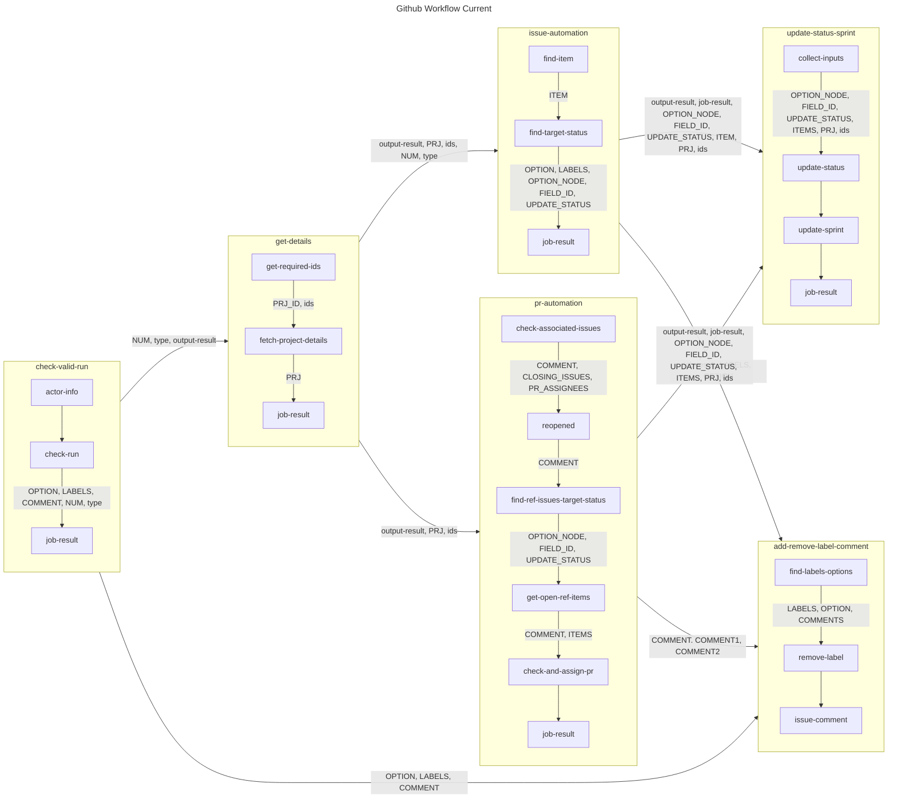

## Project Automation

- Project automation is perfomred through [project.yml](./../../../.github/workflows/project.yml)
- You can check workflow actions here: [Project Automate](https://github.com/Arc-i-Tech/Arc-i-Tech.github.io/actions/workflows/project.yml)

Below is the Actions/ Workflow diagram:

