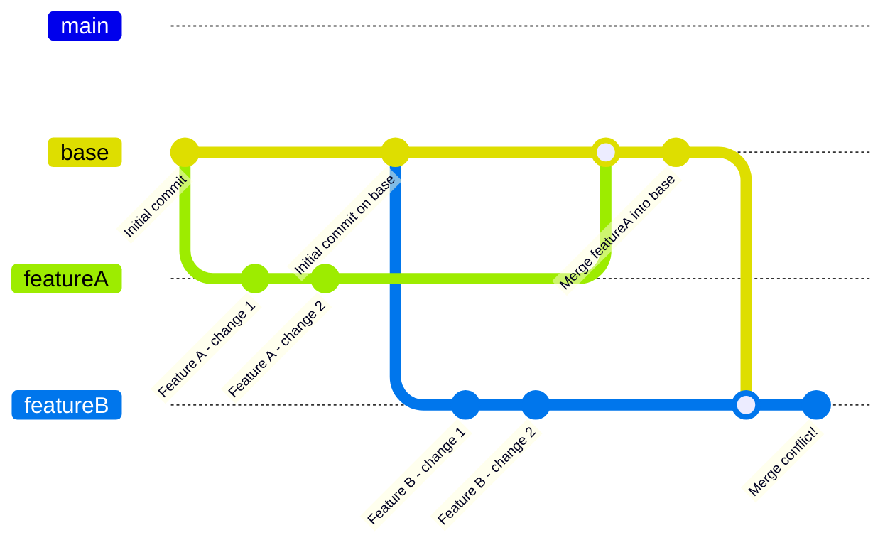
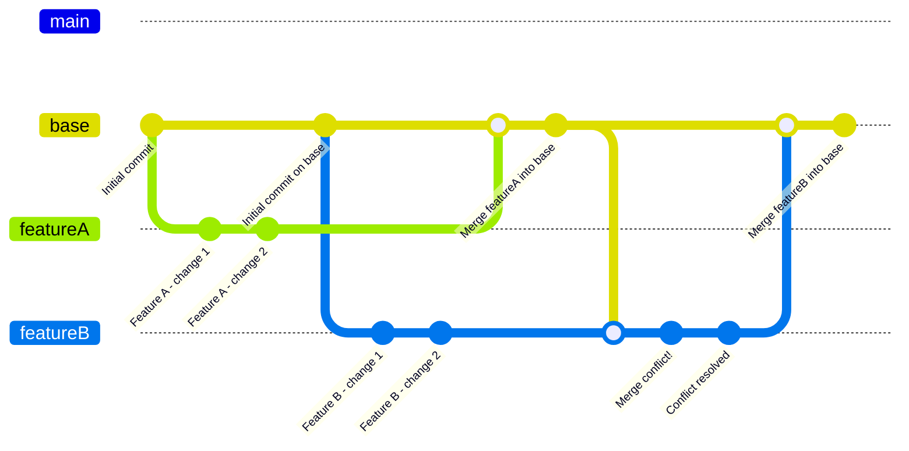

## Conflict
When two or more developers make changes to the same line in same file, then when they create a pull request/ try to merge the changes into the base/ target/ parent branch the error comes for merging the changes is known as conflict or merge conflict.

## Scenario
First, let’s outline a simple scenario involving two developers working on the same repository, leading to a conflict:

1. **Developer A** creates a branch from `base` called `featureA` and makes some commits.
2. **Developer B** creates a branch from `base` called `featureB` and also makes some commits.
3. Both developers make changes to the same line in the same file, _leading to a merge conflict when they attempt to merge back into `base`_.

### Diagram

### Explanation
1. **Initial Commit:** The `base` branch starts with an initial commit.
2. **Feature Branches:** Two feature branches (`featureA` and `featureB`) are created.
3. **Commits on Feature Branches:** Each developer makes two commits in their respective branches.
4. **Merge into `base`:** The first feature branch (`featureA`) is merged into `base`, creating a new commit on `base`.
5. **Merge Conflict:** When Developer B tries to merge `featureB` into `base`, a conflict arises, illustrated with a commit labeled **"Merge conflict!"**.

## Resolving Conflict
To illustrate the resolution of the conflict, you can extend the diagram:

1. **Conflict Resolution:** After encountering the conflict, Developer B resolves the conflict and makes a new commit labeled **"Conflict resolved."**
2. **Final Merge:** Finally, Developer B merges `featureB` into `base`, completing the process.

## Possible Cases
#### Concurrent Line Modifications (Same File, Same Line)
**Description:** Two branches modify the same line in the same file. This is the classic case of a merge conflict where Git cannot automatically decide which change to keep.

**Example:**
- Developer A changes line 10 in `file1.java` to "Updated by Developer A."
- Developer B changes line 10 in `file1.java` to "Updated by Developer B."
- When merging, Git sees that both developers made conflicting edits to the same line and requires manual resolution.

#### File Deletion Conflicts
**Description:** One branch deletes a file while another branch edits that same file. Git doesn’t know whether to keep the changes or delete the file, resulting in a conflict.

**Example:**
- On `featureA`, Developer A deletes `file2.java`.
- On `featureB`, Developer B updates `file2.java`.
- When merging `featureB` into `main`, Git is unsure if it should delete the file or keep the changes, resulting in a conflict.

#### File Renaming Conflicts
**Description:** A file is renamed in one branch while being edited or renamed differently in another branch. Git encounters a conflict trying to reconcile the renames or updates.

**Example:**
- On `featureA`, Developer A renames `file3.java` to `new_file3.java`.
- On featureB, Developer B makes edits to `file3.java` without renaming it.
- Upon merging, Git is uncertain how to handle the change since the file has been moved in one branch and modified in another.

#### Overlapping Changes in Adjacent Lines
**Description:** Both branches modify adjacent lines in the same file, which may not result in a direct conflict but can sometimes lead to a _“nearby conflict”_ if the changes interfere with each other.

**Example:**
- Developer A modifies lines 15–20 in `file4.java`.
- Developer B modifies lines 21–25 in `file4.java`.
- Git may detect a potential conflict, depending on how close the changes are, and might prompt for manual resolution.

#### Binary File Conflicts
**Description:** Conflicts involving binary files (such as images or compiled files) cannot be resolved by Git, as it cannot compare the contents of binary files to identify the differences.

**Example:**
- Developer A replaces an image file `logo.png` with a new version on `featureA`.
- Developer B also replaces `logo.png` with a different image on `featureB`.
- Git prompts a conflict since it cannot automatically merge the two binary files, and one of the versions needs to be chosen manually.

#### Simultaneous File Addition (Same File Name)
**Description:** Both branches add a new file with the same name, but with different content. Git sees both files as new, resulting in a conflict.

**Example:**
- Developer A creates `utils.java` on `featureA` with helper functions for file management.
- Developer B also creates `utils.java` on `featureB` with functions for data processing.
- When merging, Git flags the conflict because it finds two different files named `utils.java`.

#### Directory Structure Conflicts
**Description:** One branch modifies files within a directory structure that another branch changes or deletes. These conflicts arise when branches affect the same directories but in incompatible ways.

**Example:**
- Developer A moves a set of files from `src/helpers/` to `src/utils/` on `featureA`.
- Developer B adds new files to `src/helpers/` on `featureB`.
- When merging, Git may encounter conflicts, as it cannot resolve both changes in the directory structure.

#### Submodule Conflicts
**Description:** When working with _Git submodules_, conflicts can occur if two branches reference different versions of the same submodule, resulting in an uncertain state.

**Example:**
- On `featureA`, Developer A updates the docs submodule to `commit abc123`.
- On `featureB`, Developer B updates the docs submodule to `commit xyz456`.
- Git sees two different versions of the submodule referenced, creating a conflict that requires a manual decision.

#### Conflicts in Rebase Operations
**Description:** During a rebase, conflicts often occur when trying to apply commits from one branch onto the base of another, especially when both branches have modified the same files.

**Example:**
- Developer A makes several changes to `file5.java` on `featureA`.
- Developer B _rebases_ `featureB` onto `featureA`.
- Each commit in `featureB` is applied on top of `featureA`, potentially triggering conflicts if any of the `featureA` commits modify the same sections in `file5.java`.

#### Merge Conflicts in Large Refactoring
**Description:** During large-scale refactoring, such as renaming many variables or moving large code sections, Git struggles to reconcile the changes if both branches touch the same files.

**Example:**
- On `featureA`, Developer A refactors variable names in `file6.java`.
- On `featureB`, Developer B changes the logic in `file6.java` using the old variable names.
- When merged, the extensive structural changes result in conflicts that are hard to resolve automatically.