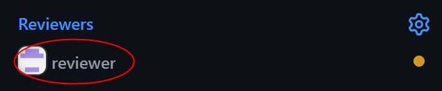

## Pull Request Guidelines _(PR-Pull Request)_
Please, go through these steps before you submit a PR.

1. Make sure that your PR is not a **duplicate**.
2. Follow `pull request` **template** for PR creation.
   - Template give information about what description should added, which checklist should be completed for PR.
   - _PR templates are open for any suggestions or updates_
3. If **work is not finished** then avoid creating PR.
   - If it is necessary to create PR even if work not finished then create `Draft Pull Request`.
   - Below can be possible reasons for creating `Draft Pull Request`:
     - Early reviews needed to finish remaining work
     - Assignee of issue _(for which PR is getting created)_ is not able to continue work on this issue.
     - If PR does not belongs to any of the issue.
4. **Target/ base** branch for your PR must be of parent issue branch of your issue.
   - Parent issue can be **epic/ user-story/ task** _Do not create PR for this branches as base - `main/ *-main/ deployment`, **only epic assignee or code owners can do it**._
   - If your PR is without issue, then select relevant **epic/ user-story** branch as a **target/ base** branch.
   - if in case such **epic/ user-story** not available at the moment then select any of ***-main** branch as target, in the `Draft Pull Request` final **target/ base** can be decided based on work done in PR.
5. Link a related **issue** for this PR.
   - Related **issue** is nothing but for which issue this PR is created.
   - Use **closes #issue_no** as last line in your PR description to link issue.
   - _Additionally in the **Development** section as well link related issue._
6. Once your PR is ready add reviewers. Add  **[Arc-i-tech/reviewers](https://github.com/orgs/Arc-i-Tech/teams/reviewers)** as reviewer so that members of **reviewers** team can submit their reviews.
   -  For any `Pull Request` targeting **epic/ *-main** branch approvals from **2** reviewers is mandatory to get pull request approved.
7. Reviewers will review th `Pull Request` and can do either of these:
   - **Comment**: Any general comment for your PR. Suggesting for any guidelines etc.
     - PR can't be merged/ accepted with approval.
   - **Approve**: PR is approved with all the changes and after resolving conversations if any.
     - PR will be accepted and can be merged with target branch.
   - **Request Changes**: PR is not accepted and changes request in your branch.
     - request for changes can be in the form of _review message_ / _inline comment_ / _Conversations_ etc.
     - Request changes must be done to get PR accepted.
8. Once you get **2** or more PR reviews **approved** and **all checks are passed** you can merge your PR.
   - You can use **Squash and merge** option to merge and close the PR.
9.  Once your PR is merged, then close the **ISSUE** for which you created this PR.

_P.S. Any suggestions for PR are always welcomed._
