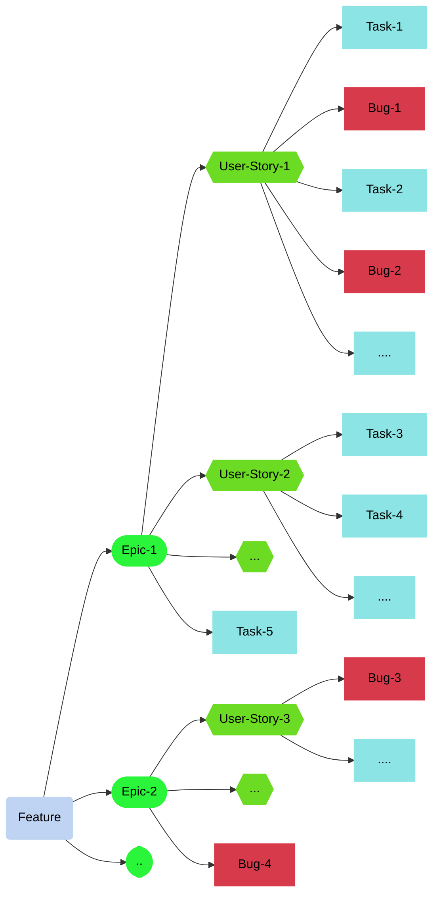

### Data Model

```mermaid
flowchart LR;
  f1(Feature)
  e1([Epic-1])
  e2([Epic-2])
  e3([..])
  us1{{User-Story-1}}
  us2{{User-Story-2}}
  us3{{...}}
  us4{{User-Story-3}}
  us5{{...}}
  t1[Task-1]
  t2[Task-2]
  t3[Task-3]
  t4[Task-4]
  t5[Task-5]
  t6[....]
  t7[....]
  t8[....]
  b1[Bug-1]
  b2[Bug-2]
  b3[Bug-3]
  b4[Bug-4]
  
  style f1 fill:#bfd4f2,stroke:#bfd4f2,color:#000
  style e1 fill:#2AF53A,stroke:#2AF53A,color:#000
  style e2 fill:#2AF53A,stroke:#2AF53A,color:#000
  style e3 fill:#2AF53A,stroke:#2AF53A,color:#000
  style us1 fill:#6BDC23,stroke:#6BDC23,color:#000
  style us2 fill:#6BDC23,stroke:#6BDC23,color:#000
  style us3 fill:#6BDC23,stroke:#6BDC23,color:#000
  style us4 fill:#6BDC23,stroke:#6BDC23,color:#000
  style us5 fill:#6BDC23,stroke:#6BDC23,color:#000
  style t1 fill:#8DE4E4,stroke:#8DE4E4,color:#000
  style t2 fill:#8DE4E4,stroke:#8DE4E4,color:#000
  style t3 fill:#8DE4E4,stroke:#8DE4E4,color:#000
  style t4 fill:#8DE4E4,stroke:#8DE4E4,color:#000
  style t5 fill:#8DE4E4,stroke:#8DE4E4,color:#000
  style t6 fill:#8DE4E4,stroke:#8DE4E4,color:#000
  style t7 fill:#8DE4E4,stroke:#8DE4E4,color:#000
  style t8 fill:#8DE4E4,stroke:#8DE4E4,color:#000
  style b1 fill:#d73a4a,stroke:#d73a4a,color:#000
  style b2 fill:#d73a4a,stroke:#d73a4a,color:#000
  style b3 fill:#d73a4a,stroke:#d73a4a,color:#000
  style b4 fill:#d73a4a,stroke:#d73a4a,color:#000

  f1 --> e1
  f1 --> e2
  f1 --> e3
  e1 --> us1
  e1 --> us2
  e1 --> us3
  e1 --> t5
  e2 --> us4
  e2 --> us5
  e2 --> b4
  us1 --> t1
  us1 --> b1
  us1 --> t2
  us1 --> b2
  us1 --> t6
  us2 --> t3
  us2 --> t4
  us4 --> b3
  us2 --> t7
  us4 --> t8
```